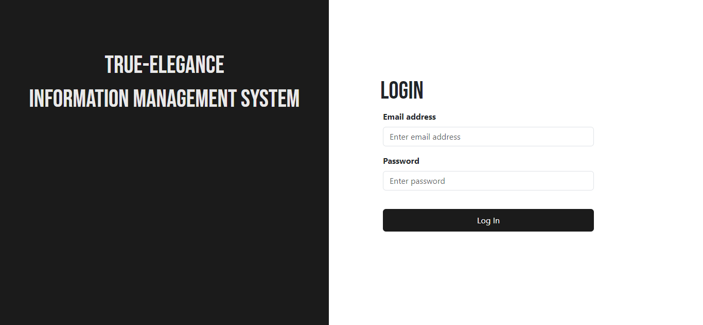
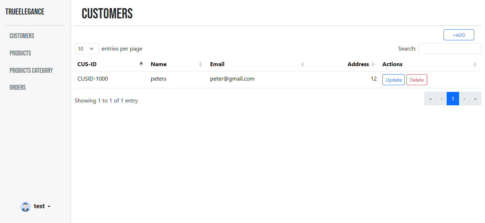
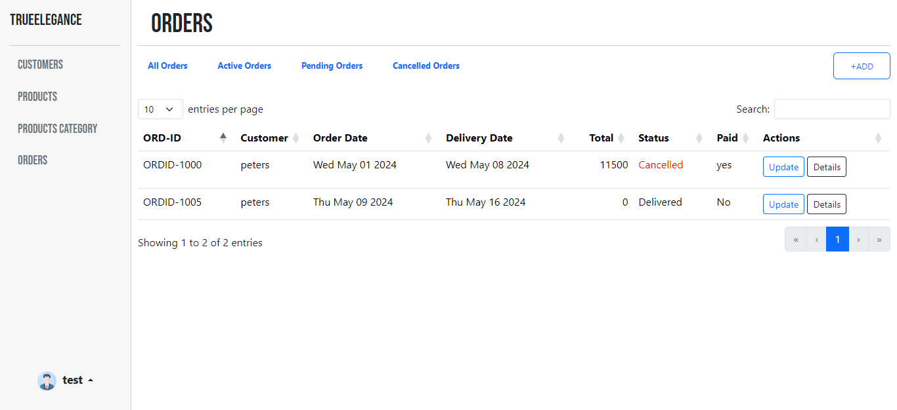
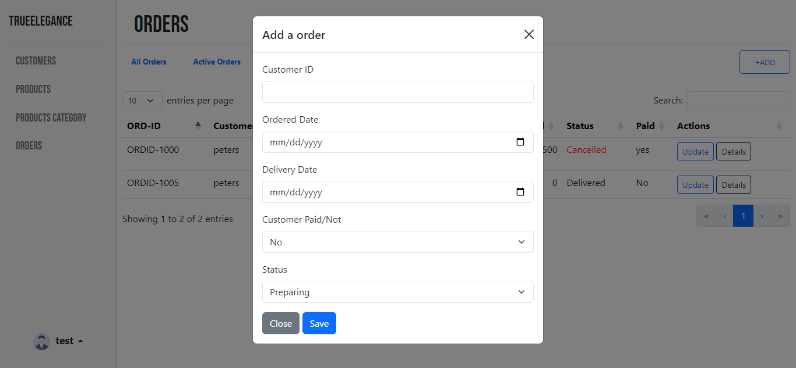
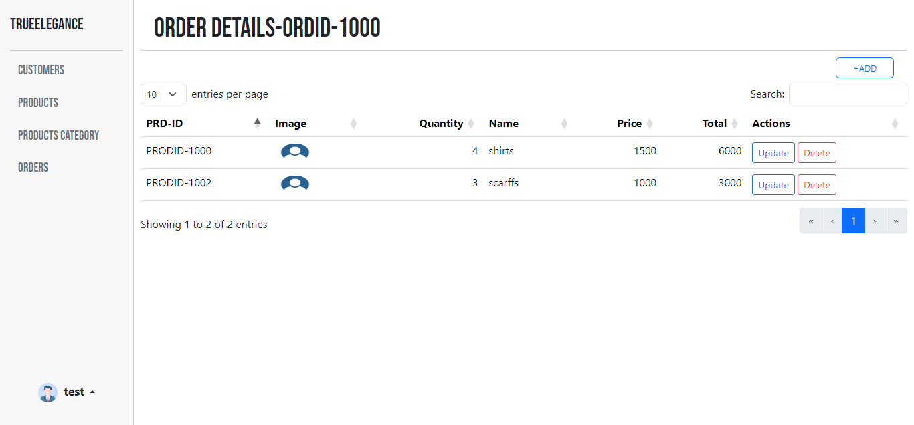
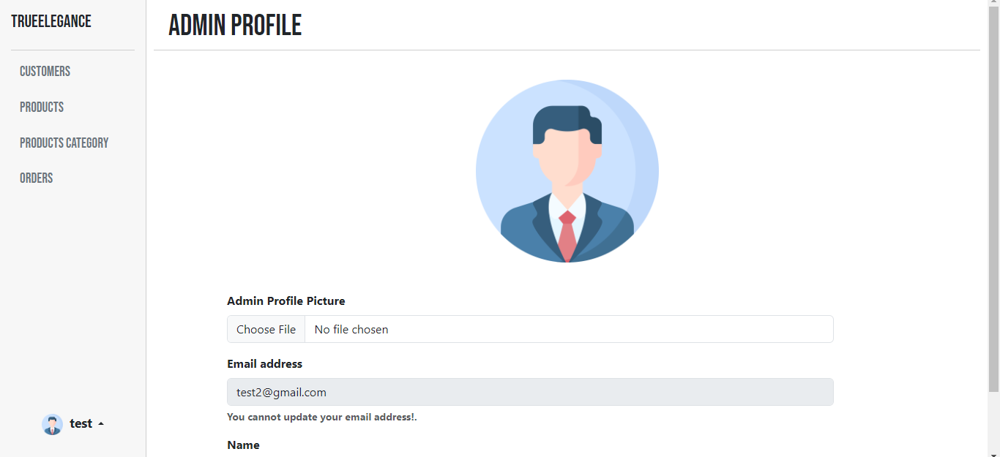

# ORDERS MANAGEMENT SYSTEM
This is an order management system where the admin can record the daily order details of the shop in this system and update them as necessary. Used **handlebars** to render dynamic pages and **Datatables** to show Customer, Categories, Products and Order details clearly. Features include **user authentication (register, login), Performing CRUD operations, APIs authorizations etc.**

## Customers Page
When the admin adds customers to the system a unique ID is generated for each customer as CUSID which can be used to identify each customer separately.

## Orders Page
On the orders page, you can add and update orders and for each order, you can add, update and delete product details that are included in that order.

## Profile Page
on the profile page, Admin can update their profile and upload a profile image.

#### Technologies Used - Javascript, bootstrap, Handlebars, Node.js/Express.js, MongoDB/Mongoose, express-session